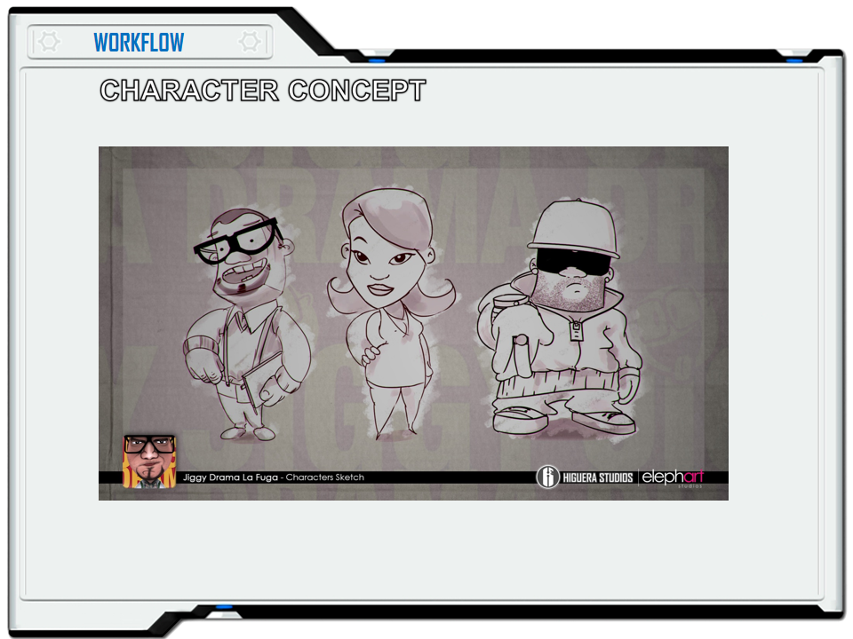
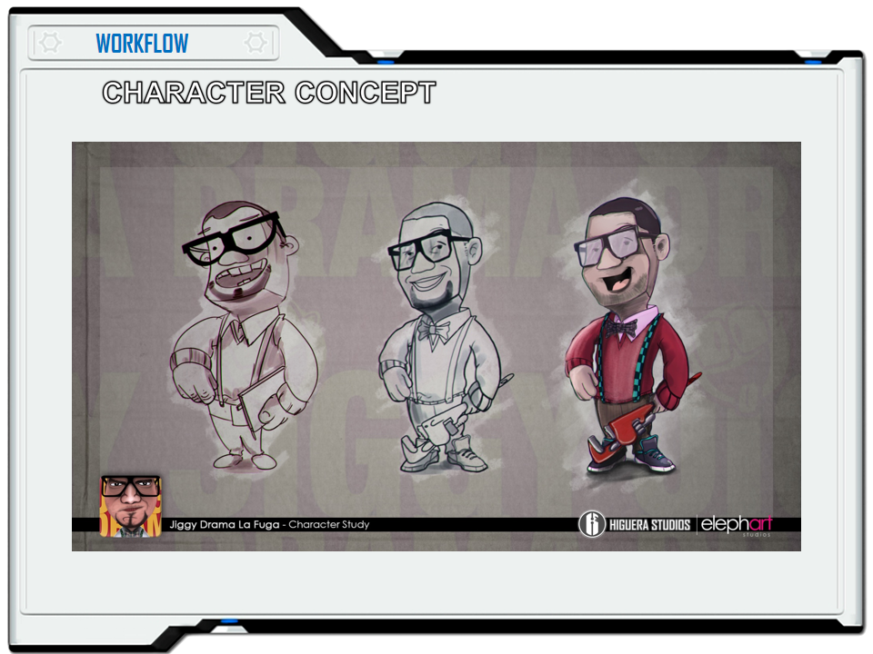
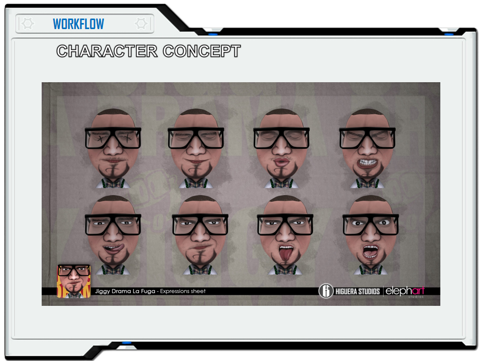
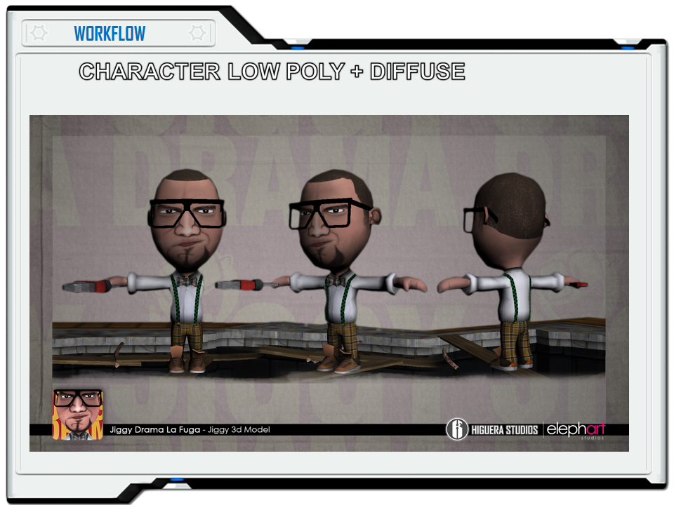
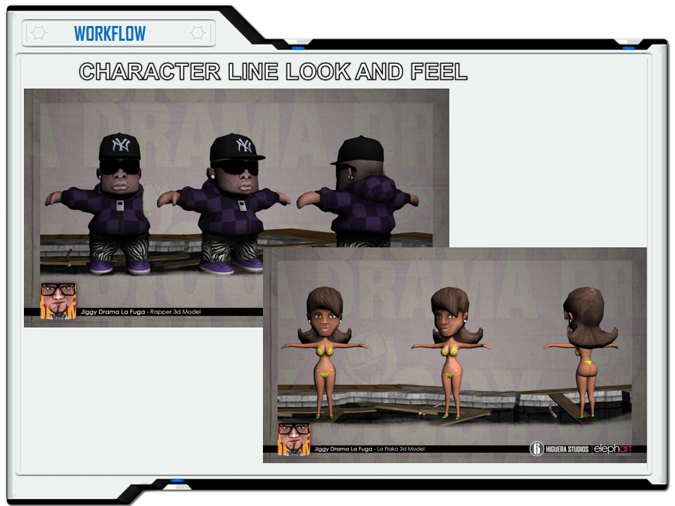

<!-- configuracion de colores es opcional pero ultil-->
<section id="themes">
	<h2>Themes setting</h2>
	

		Themes:  
		<a href="?#/themes">Default</a> -
		<a href="?theme=sky#/themes">Sky</a> -
		<a href="?theme=beige#/themes">Beige</a> -
		<a href="?theme=simple#/themes">Simple</a> -
		<a href="?theme=serif#/themes">Serif</a> -
		<a href="?theme=night#/themes">Night</a>  
		<a href="?theme=moon#/themes">Moon</a> -
		<a href="?theme=solarized#/themes">Solarized</a>
	

</section>

Slide:    

# Caso Jiggy Drama La Fuga

Profesor:

John Higuera

Slide:

 

Slide:

 

Slide:

 

Slide:

 

Slide:

 

